<!-- This file is generated by scripts/build.mjs.
     Edit content in data/profile.json and layout/style in src/template.mjs, then run `npm run build`.
     The GitHub Action refreshes the stats + heatmap on a schedule.
     Layout is table-free on purpose: GitHub styles HTML tables with cell borders,
     which would box the design. Sections are images; interactive parts are inline links. -->

<picture><source media="(prefers-color-scheme: dark)" srcset="assets/brand/wordmark-stacked-dark.png">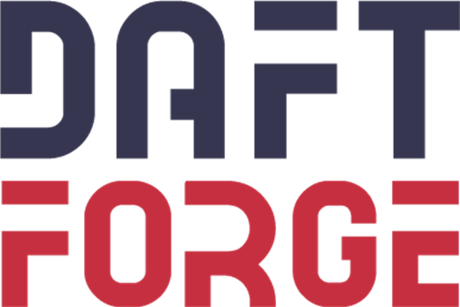</picture>

**I'm James Baker — building as DaftForge (@DaftVino)**

I design and ship engineering tooling, workspace automation, and products that solve real problems. The tools are serious. The wit is dry but complementary.

 

<a href="https://daftforge.com"><picture><source media="(prefers-color-scheme: dark)" srcset="assets/panels/bdg-web-dark.png"></picture></a> <a href="mailto:daftvino@daftforge.com"><picture><source media="(prefers-color-scheme: dark)" srcset="assets/panels/bdg-email-dark.png"></picture></a> <a href="https://www.linkedin.com/in/james-baker-9524b783"><picture><source media="(prefers-color-scheme: dark)" srcset="assets/panels/bdg-linkedin-dark.png"></picture></a>  

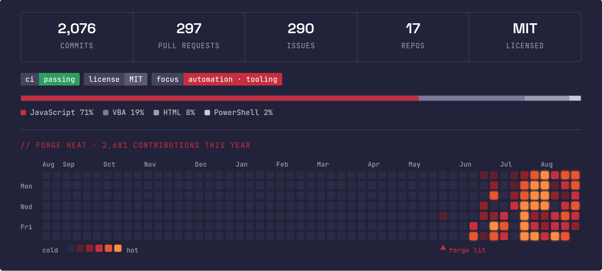

<picture><source media="(prefers-color-scheme: dark)" srcset="assets/panels/cap-dark.png">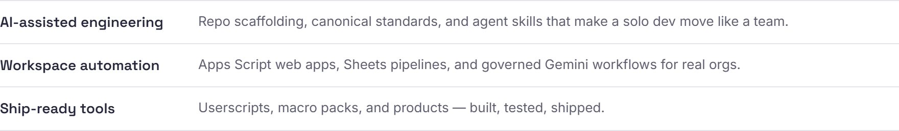</picture>

<a href="https://github.com/DaftVino/daftplate"><picture><source media="(prefers-color-scheme: dark)" srcset="assets/panels/tile-daftplate-dark.png">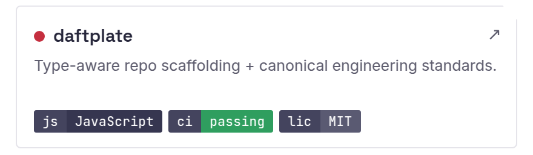</picture></a>
<a href="https://github.com/DaftVino/daftkit"><picture><source media="(prefers-color-scheme: dark)" srcset="assets/panels/tile-daftkit-dark.png">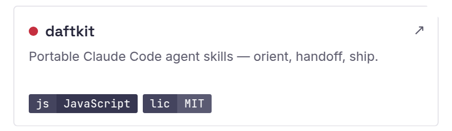</picture></a>
<a href="https://github.com/DaftVino/daft-gemini-playbook"><picture><source media="(prefers-color-scheme: dark)" srcset="assets/panels/tile-daft-gemini-playbook-dark.png">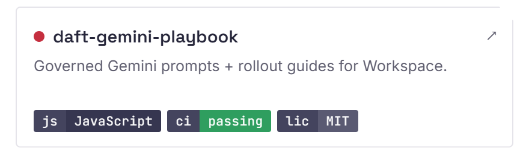</picture></a>
<a href="https://github.com/DaftVino/sheetweaver-webapp"><picture><source media="(prefers-color-scheme: dark)" srcset="assets/panels/tile-sheetweaver-webapp-dark.png">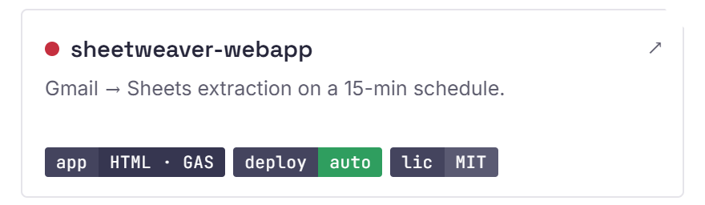</picture></a>
<a href="https://github.com/DaftVino/torn-bookie-live-scores"><picture><source media="(prefers-color-scheme: dark)" srcset="assets/panels/tile-torn-bookie-live-scores-dark.png">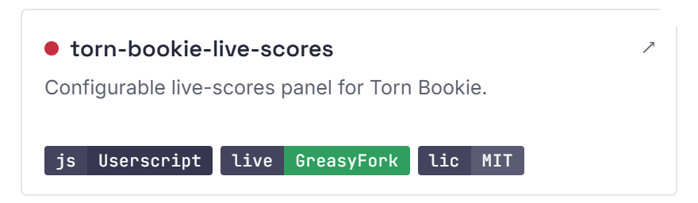</picture></a>
<a href="https://github.com/DaftVino/sheetforge"><picture><source media="(prefers-color-scheme: dark)" srcset="assets/panels/tile-sheetforge-dark.png">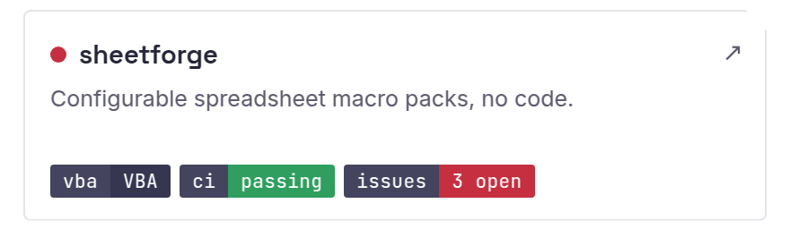</picture></a>

<a href="https://daftforge.com/tools/daft-cal/"><picture><source media="(prefers-color-scheme: dark)" srcset="assets/panels/tile-daft-cal-dark.png">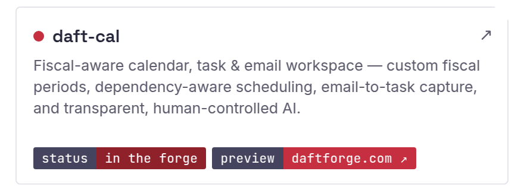</picture></a>
<a href="https://daftforge.com/tools/project-cobalt/"><picture><source media="(prefers-color-scheme: dark)" srcset="assets/panels/tile-project-cobalt-dark.png">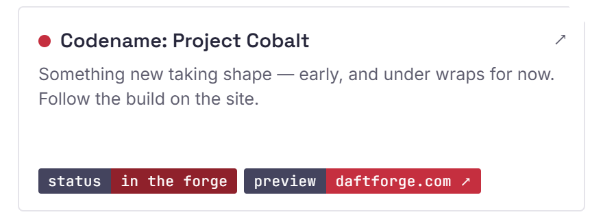</picture></a>

<a href="https://donatr.ee/daftvino"><picture><source media="(prefers-color-scheme: dark)" srcset="assets/panels/support-dark.png"></picture></a>

<picture><source media="(prefers-color-scheme: dark)" srcset="assets/brand/footer-dark.png"></picture>

<a href="https://daftforge.com">daftforge.com</a> &nbsp;·&nbsp; <a href="https://daftforge.com/contact/">Work with me</a> &nbsp;·&nbsp; <a href="https://calendar.google.com/calendar/u/0/appointments/schedules/AcZssZ3ArXqwmG3jnBJlQQuIDbgoQ8WW45mED_ARsHeQq0CNjhTvBClW9IbRla0vkZiLtU4CqRIzhUeV">Book a call</a> &nbsp;·&nbsp; <a href="https://www.linkedin.com/in/james-baker-9524b783">LinkedIn</a> &nbsp;·&nbsp; <a href="mailto:daftvino@daftforge.com">Email</a> &nbsp;·&nbsp; <a href="https://github.com/DaftVino">GitHub</a>

